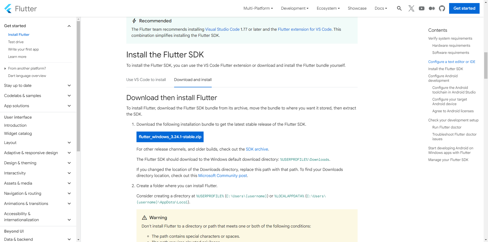
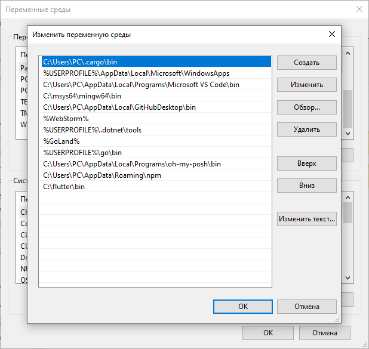
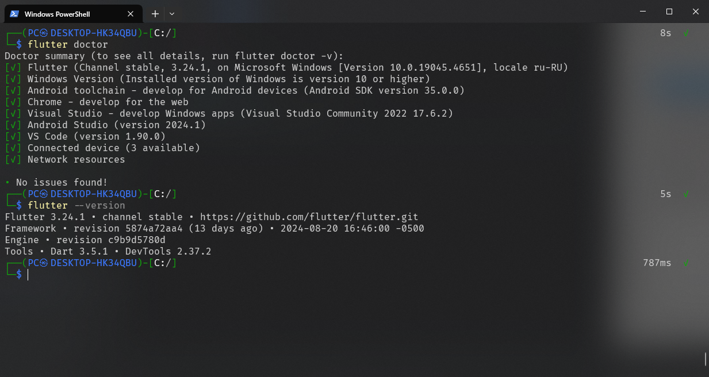
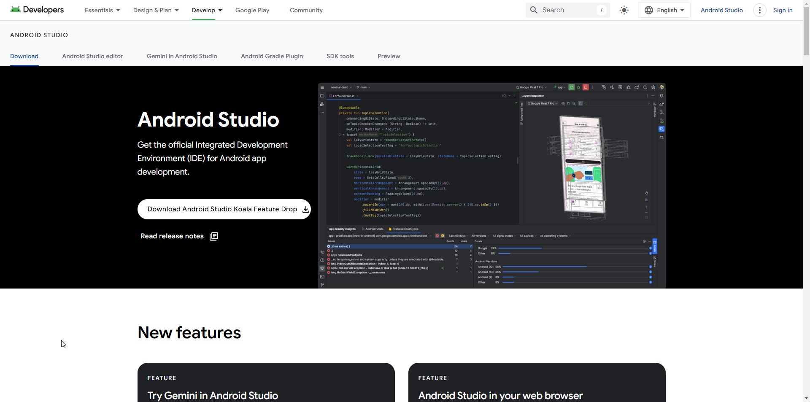
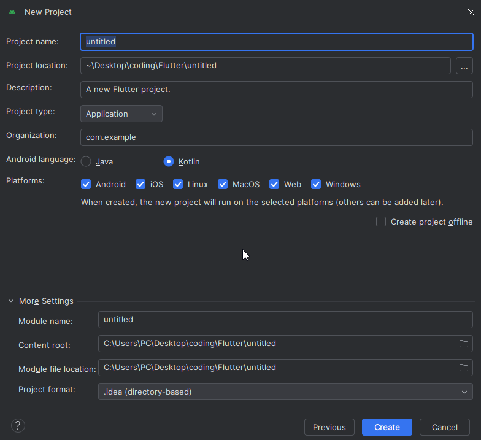
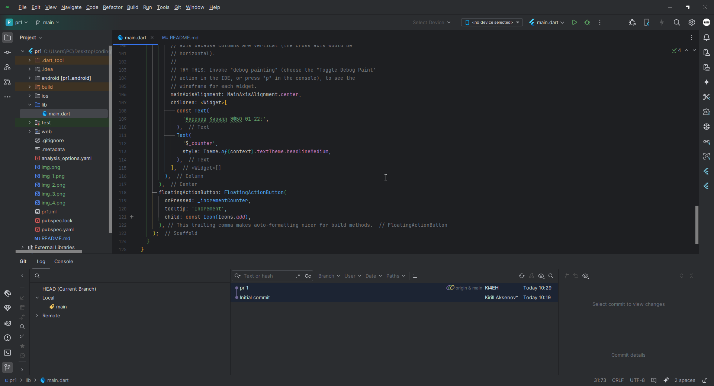
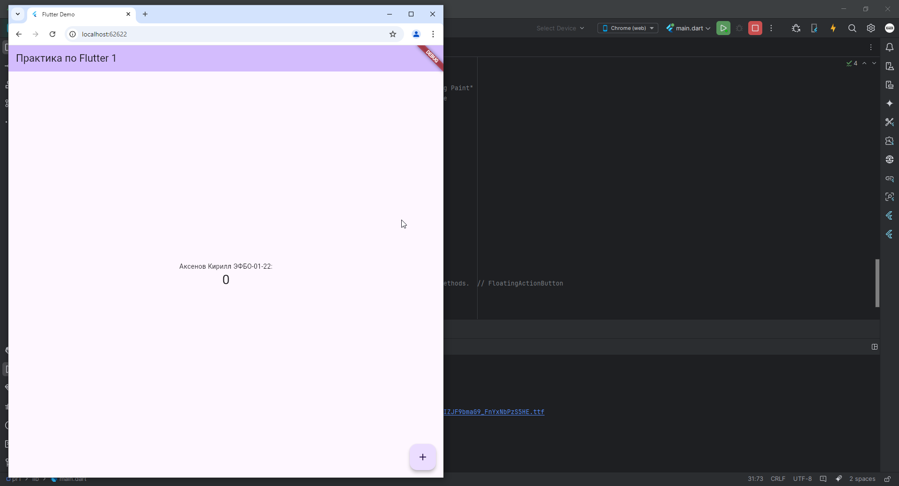

# Практика 1

### Установка
1. Скачал архив Flutter SDK

2. Перекинул папку на диск C:\ и обновил PATH

3. Проверил корректность установки

4. Поставил Android Studio

5. Создал новый пустой проект

6. Изменил main.dart

7. Запустил эмулятор
